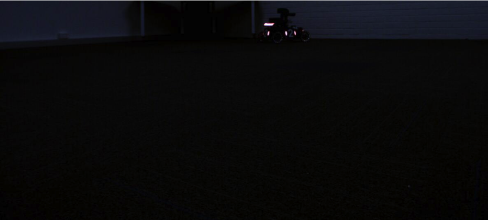
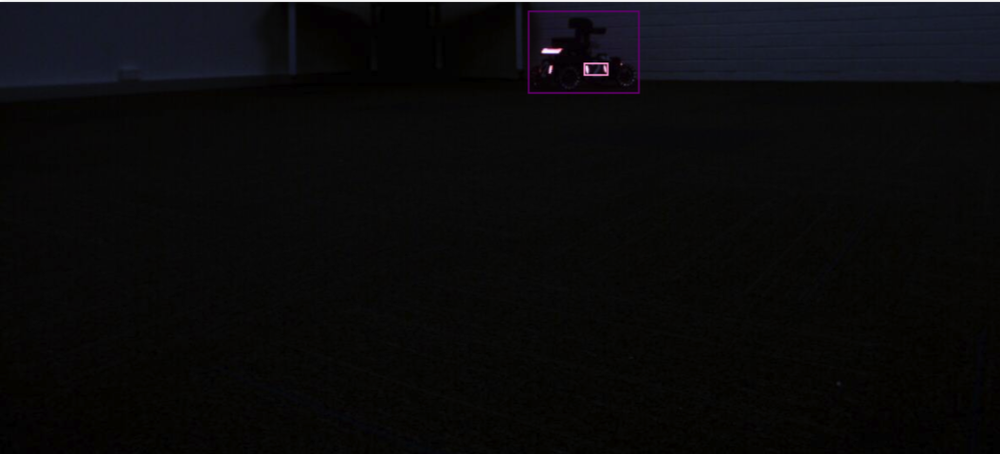

# RoboMaster AI Challenge (2.0.0)

## Table of contents

* [Introduction](#introduction)
* [Sample Input Image](#sample-input-image)
* [System Components](#system-components)
* [User Stories](#user-stories)
* [Change Log](#change-logs)
* [Test Cases](#test-cases)
* [User Guide](#user-guide)

## Introduction

This project is to enhance the capabilities of the robot to be competitive in the [RoboMaster AI Challenge](https://www.robomaster.com/en-US/robo/icra). The two main objectives are to enable the robot to locate and identify different types of enemies' armour in the images captured by our robot's camera and the outpost camera. 

According to the [rules of the competition](https://www.robomaster.com/en-US/resource/pages/announcement/1039), robots shoot at enemy robots' armour to score points. Robots score different points depending on which enemy robots' armour they hit: front, side or back. Therefore, granting our robot the capabilities of locating and identifying enemies' armour automatically will significantly increase the chance of winning in the competition. After implementing the two algorithms, An interface displaying the outcome of location and identification will be created to examine the performance of the algorithms. 

## Sample Input Image
### unlabelled image


### unlabelled image (updated for sprint2)


### labelled image


### labelled image (updated for sprint2)


## System Components

[YOLO](https://pjreddie.com/darknet/yolo/) (You only look once) is used for both the armour location and identification algorithms. It's a state-of-the-art real-time object detection system, which can process images fast and achieve a high mAP. [CVAT](https://github.com/openvinotoolkit/cvat) is used for labelling images, and Google Colab is used for training. 

## User Stories
  1. [US1] locate the opponent robot’s armour in the pictures
  2. [US2] recognize the type of the armour pad the enemy is showing
  
## Change Logs
## [Released] 
## [v1.0]
### Added
### Changed
## [v1.1]
### Added
### Changed
## [v1.2]
### Added
### Changed

## Test Cases

## User Guide (Release v1.2)
1. Sign in to Google Colab using a Google account (https://colab.research.google.com/)
2. Upload the notebook to Google Colab 
  ``` notebook location: rm_ai_challenge_2020s2_koala/build/colab_notebook/RM_Koala_YOLO_approach.ipynb ```
3. Run all the cells.
4. Scroll down to the bottom of the notebook to view results.
## User Guide (Release 2.0.0)
